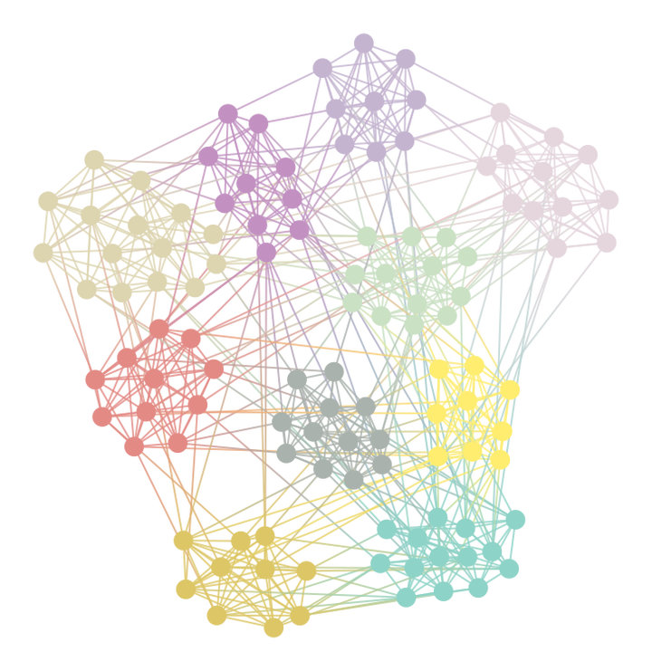
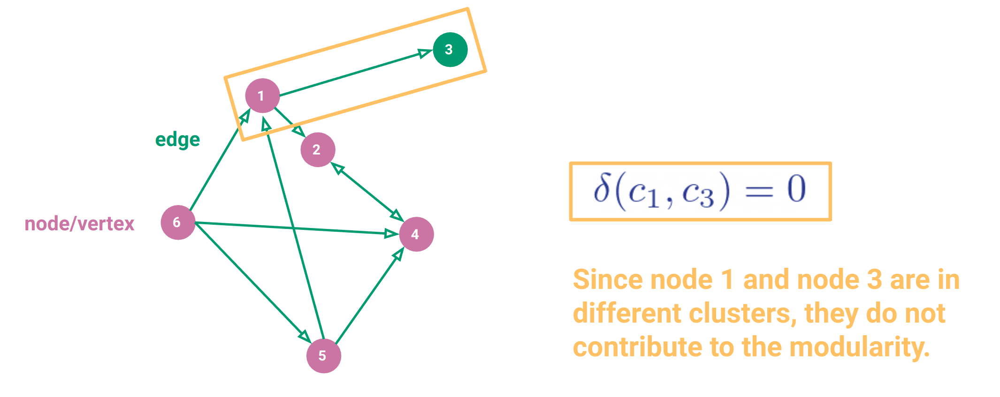
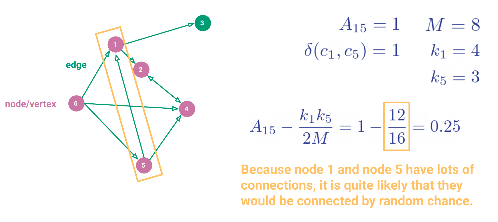
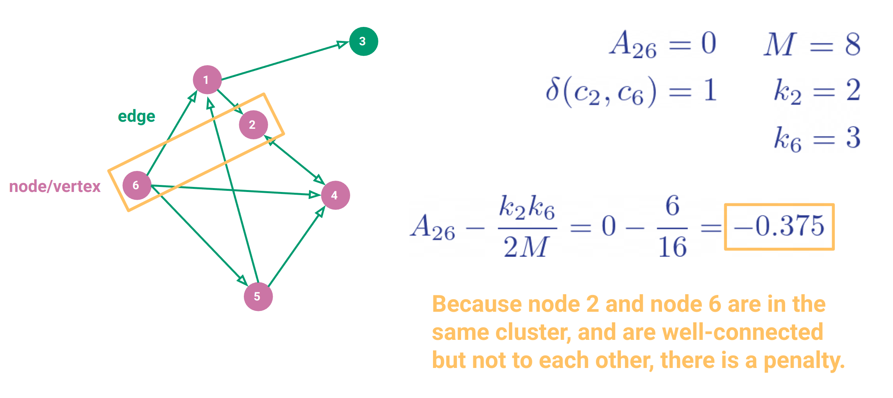

.. _community_detection:

Community Detection
===========================

In graph theory, community detection is the task of identifying groups of nodes in a graph that are
densely connected internally. These groups are called communities, and the goal is to maximize the
number of edges within a community and minimize the number of edges between communities. Or,
in other words, community detection is used to find clusters of related data points. In the case
of flow cytometry data, for example, communities could represent a cluster of similar cells, such
as B cells.

Before discussing community detection algorithms, it is important to understand some basic graph
terminology.

Graphs
******

A graph is composed of nodes (vertices) and edges. Each edge is connected to two nodes,
and each node may be connected to zero or more edges. When drawn in a diagram, edges are typically
represented by straight lines, while nodes are represented by circles or points.

In set notation:

.. math::

    G = (V, E)

where :math:`V` is the set of nodes, and :math:`E` is the set of edges:

.. math::

    V = \{v_1, v_2, \ldots, v_n\}

    E = \{e_1, e_2, \ldots, e_m\}

We could alternatively write the edges with respect to the nodes they connect:

.. math::

    E &= \{(v_i, v_j), (v_k, v_l), \ldots\} \\
      &= \{e_{ij}, e_{kl}, \ldots\}

where :math:`e_{ij}` is a directed edge from :math:`v_i` to :math:`v_j`.

Communities
***********

A community is a unique set of nodes:

.. math::

    C_i &= \{v_1, v_2, \ldots, v_k\} \\
    C_i &\subseteq V \\
    C_i &\bigcap C_j = \emptyset ~ \forall ~ i \neq j

and the union of all communities must be the total set of nodes:

.. math::

    \bigcup_{i=1}^{n} C_i = V

Ideally, when finding communities (or clusters), we want to maximize the number of edges within
a community and minimize the number of edges between communities.

Partitions
***********

A partition is the set of all communities:

.. math::

    \mathcal{P} = \{C_1, C_2, \ldots, C_n\}

where each community is unique.

Modularity
**********

How can we assess if our partition is "good", i.e. that we have clustered the data well? One way
is to use modularity. Modularity is a measure of the quality of a partition, and it is defined as:

.. math::

    Q = \frac{1}{2M} \sum_{\mu=1}^N \sum_{\nu=1}^N
        \left(A_{\mu\nu} - E[n_{\mu}, n_{\nu}] \right) \delta(c_{\mu}, c_{\nu})

where:

- :math:`M` is the total number of edges in the graph
- :math:`N` is the number of nodes in the graph
- :math:`n_{\mu}` is node :math:`\mu`
- :math:`c_{\mu}` is the community to which node :math:`n_{\mu}` belongs
- :math:`A_{\mu\nu}` is the adjacency matrix of the graph:

  .. math::

      A_{\mu\nu} := \begin{cases}
          1 & \text{ if } n_{\mu} \text{ and } n_{\nu} \text{ are connected} \\
          0 & \text{ otherwise}
      \end{cases}
- :math:`E[n_{\mu}, n_{\nu}]` is the probability that the nodes :math:`n_{\mu}` and :math:`n_{\nu}`
  would be connected if the edges were placed at random
- :math:`\delta(c_{\mu}, c_{\nu})` is the Kronecker delta function:

  .. math::

      \delta(c_{\mu}, c_{\nu}) := \begin{cases}
          1 & \text{ if } c_{\mu} = c_{\nu} \\
          0 & \text{ otherwise}
      \end{cases}

The modularity ranges from -1 to 1, where 1 indicates a perfect partition and -1 indicates a
partition that is no better than random.

A common way to measure :math:`E[n_{\mu}, n_{\nu}]` is:

.. math::

    E[n_{\mu}, n_{\nu}] = \frac{k_{\mu} k_{\nu}}{2M}

where:

- :math:`k_{\mu}` is the degree of node :math:`n_{\mu}`, i.e. the number of edges connected to
  node :math:`n_{\mu}`

Example 1: Nodes in Different Communities
------------------------------------------

Consider the following graph:

Here the nodes :math:`n_1` and :math:`n_3` are in different communities, as indicated by the
different colors. Hence, the Kronecker delta function for those nodes will be 0, and they
wil not contribute to the modularity.

Example 2: Nodes with High Likelihood of Connection
---------------------------------------------------

Consider the following graph:

Here the nodes :math:`n_1` and :math:`n_5` are in the same community. Let's compute the
probability that they would be connected by chance:

.. math::

    E[n_1, n_5] = \dfrac{k_1 k_5}{2M} = \dfrac{4 \cdot 3}{2 \cdot 8} = \dfrac{12}{16} = 0.75

So, it is quite likely that these nodes would have been connected by chance, because they
are both highly-connected nodes.

The adjacency matrix gives us:

.. math::

    A(n_1, n_5) = 1

Hence, the modularity for this pair of nodes is:

.. math::

    Q = \dfrac{1}{2M} \left(1 - 0.75\right) = \dfrac{1}{16} = 0.0625

Example 3: Disconnected Nodes with High Likelihood of Connection
-----------------------------------------------------------------

Consider the following graph:

Here the nodes :math:`n_2` and :math:`n_6` are in the same community, but they aren't connected
to each other. Let's compute the probability that they would be connected by chance:

.. math::

    E[n_2, n_6] = \dfrac{k_2 k_6}{2M} = \dfrac{2 \cdot 3}{2 \cdot 8} = \dfrac{6}{16} = 0.375

The adjacency matrix gives us:

.. math::

    A(n_2, n_6) = 0

Hence, the modularity for this pair of nodes is:

.. math::

    Q = \dfrac{1}{2M} \left(0 - 0.375\right) = -\dfrac{3}{16} = -0.1875

So, because these nodes are not connected but in the same community, the modularity is negative.