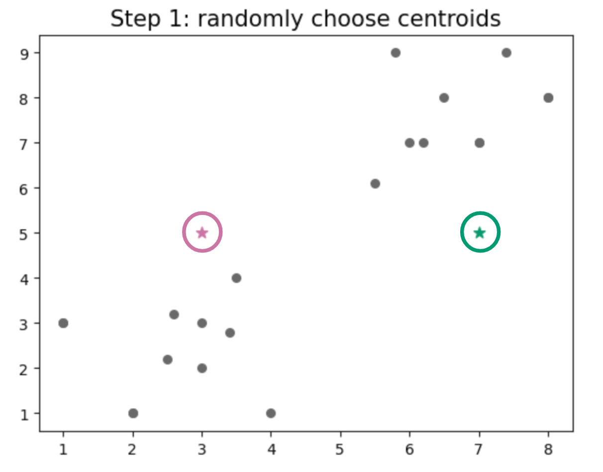
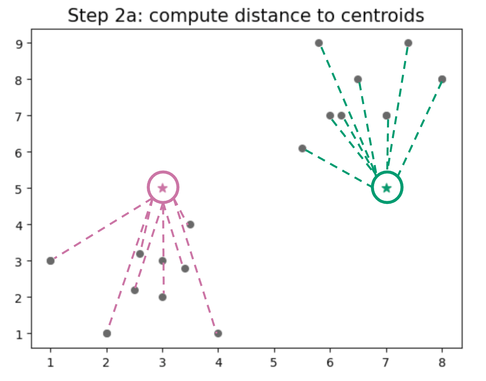
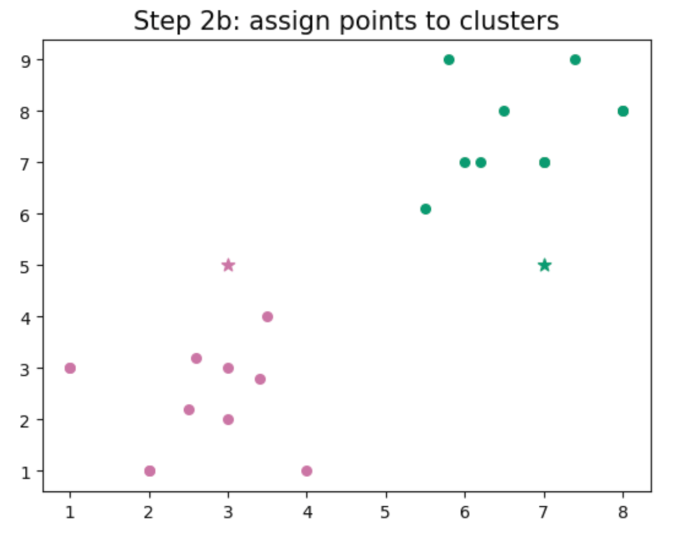
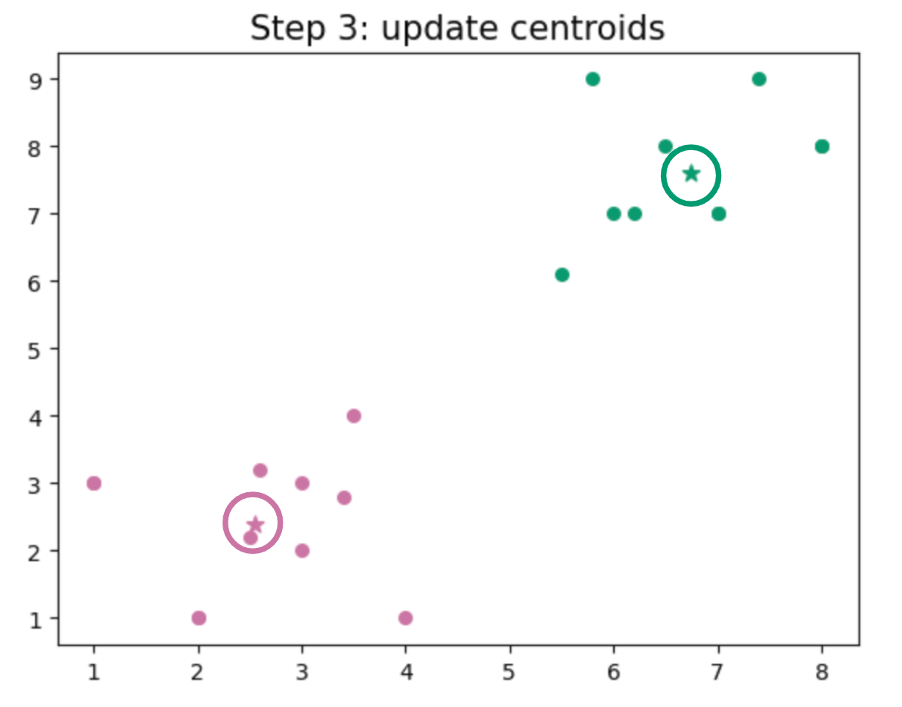

.. _hnsw_algorithm:

Hierarchical Navigable Small World (HNSW) Graph Construction
============================================================

k-nearest neighbors (kNN) algorithm
***********************************

Before describing the HNSW algorithm, let's look at the k-nearest neighbors (kNN) algorithm,
which is what the HNSW algorithm is based on. The goal of the kNN algorithm is to find ``k``
clusters in a dataset.

To begin the algorithm, we need to choose a value for ``k``.
One of the downsides to this algorithm is that the user needs to predefine the number of clusters,
and in general, we don't usually know how many clusters are in the data. One way to remedy this
is to run the algorithm many times with different values of ``k`` and then choose the best one.

1. Randomly select ``k`` points in the dataset as the initial centroids.

    **kNN Step 1:** The kNN algorithm starts by randomly selecting ``k`` points in the dataset
    as the initial centroids. In this case, ``k=2``.

2a. Compute the distance between each point in the dataset and the centroids.

    **kNN Step 2a:** The algorithm computes the distance between each point in the dataset
    and the centroids.

2b. Assign each point to the cluster of the nearest centroid.

    **kNN Step 2b:** Assign each point to the cluster of the nearest centroid.

3. Take the mean of all the points in each cluster and move the centroids to these new locations.

    **kNN Step 3:** The algorithm takes the mean of all the points in each cluster and moves
    the centroids to these new locations.

4. Repeat steps 2 and 3 until convergence.

   To determine convergence, we define a ``cost function``:

   .. math::
    
        J(c_1, \dots, c_M, \mu_1, \dots, \mu_{\kappa}) = 
            \dfrac{1}{M} \sum_{m=1}^{M} |x_m - \mu_{c_m}|^2
    
   where :math:`c_1, \dots, c_M` are the cluster assignments for each data point :math:`x_m`,
   :math:`\mu_1, \dots, \mu_{\kappa}` are the centroids for each of the :math:`\kappa` clusters,
   and :math:`M` is the total number of data points. The goal is to minimize this cost function.

One of the major downsides to the k-nearest neighbors algorithm is that it is not scalable.
When the number of data points is large, the algorithm becomes computationally expensive.
To address this, approximate nearest neighbor search algorithms have been developed. We will begin
by discussing the Navigable Small World (NSW) algorithm.

Navigable Small World (NSW) Algorithm
*************************************

Interestingly, the Navigable Small World (NSW) algorithm was borne out of sociology research.
In 1967, Stanley Milgram was studying connections between different people :cite:`milgram1967`.
He got participants to send a letter to a target person by passing it through friends.
The goal was to see how many steps it would take for the letter to reach the target person.
This experiment led to the concept of "six degrees of separation," which posits that any two people
in the world are connected by six or fewer acquaintances, or, in other words,
"it's a small world after all."

HNSW Algorithm
**************

From the original ``HNSW`` paper:

"Constantly growing amount of the available information resources has led to high demand in scalable
and efficient similarity search data structures. One of the generally used approaches for
information search is the K-Nearest Neighbor Search (K-NNS). The K-NNS assumes you have a defined
distance function between the data elements and aims at finding the K elements from the dataset
which minimize the distance to a given query. Such algorithms are used in many applications, such as
non-parametric machine learning algorithms, image features matching in large scale databases [1]
and semantic document retrieval [2]. A naïve approach to K-NNS is to compute the distances between
the query and every element in the dataset and select the elements with minimal distance.
Unfortunately, the complexity of the naïve approach scales linearly with the number of stored
elements making it infeasible for large-scale datasets. This has led to a high interest in
development of fast and scalable K-NNS algorithms" :cite:`hnsw2016`.