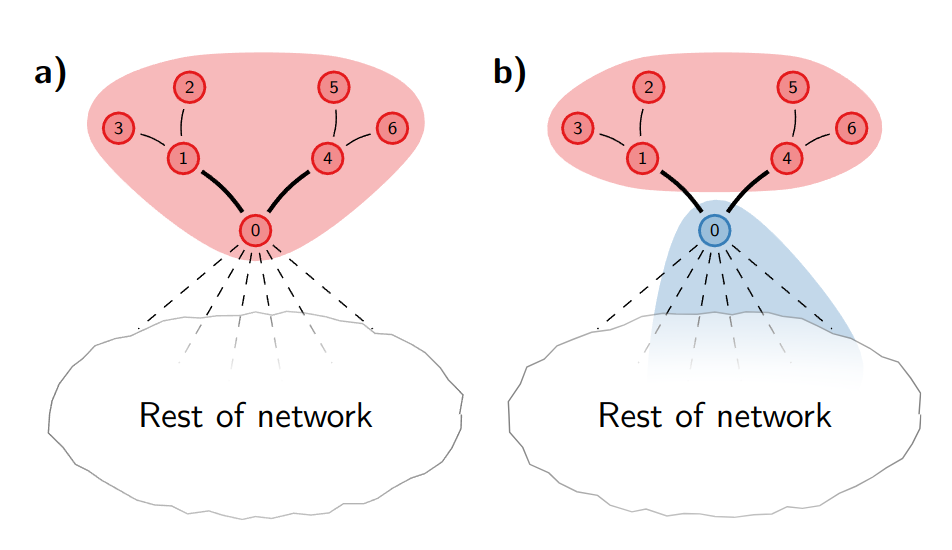

.. _louvain_method:

Louvain Method
==============

.. image:: https://img.youtube.com/vi/dGa-TXpoPz8/maxresdefault.jpg
    :width: 600
    :alt: Louvain Method YouTube Video
    :target: https://www.youtube.com/watch?v=dGa-TXpoPz8

Algorithm
*********

.. figure:: ../_static/img/louvain-algorithm-2.png
    :width: 400
    :alt: Louvain Method
    :align: left

    **Louvain algorithm**. The Louvain algorithm starts from a singleton partition in which each
    node is in its own community (a). The algorithm moves individual nodes from
    one community to another to find a partition (b). Based on this partition, an aggregate network
    is created (c). The algorithm then moves individual nodes in the aggregate network (d).
    These steps are repeated until the quality cannot be increased further
    :cite:`leiden2019`.

**Phase 1:**

1. Assign each node to its own community.
2. Calculate the modularity of the graph.

   .. code-block:: python
   
    def compute_modularity():
        # compute the modularity change of the graph
        pass

    for node in nodes:
        delta_Q_list = []
        for community in neighbor_communities:
            # compute the change in modularity
            delta_Q = compute_modularity() - modularity 
            delta_Q_list.append(delta_Q)

        # find the maximum change in modularity
        max_delta_Q = max(delta_Q_list)

        # if the modularity has improved, move the node to the corresponding community
        if max_delta_Q > 0:
            # move the node to the community with the highest modularity
            community = neighbor_communities[delta_Q_list.index(max_delta_Q)]
            community.add(node)
            # update the modularity
            modularity = modularity + max_delta_Q

3. Repeat step 2 until the stopping point.

**Phase 2:**

1. Merge all the communities from **Phase 1** into single nodes.
2. Repeat **Phase 1** on the new graph.

Disadvantages: Disconnected Communities
***************************************

The Louvain method can sometimes lead to disconnected communities, which are communities
that are not well-connected to each other. The reason for this is that the Louvain method
only merges communities, and has no mechanism to split them once they have been created.

    **Disconnected community**. Consider the partition shown in (a). When node 0 is moved to a
    different community, the red community becomes internally disconnected, as shown in (b).
    However, nodes 1–6 are still locally optimally assigned, and therefore these nodes will stay
    in the red community :cite:`leiden2019`.