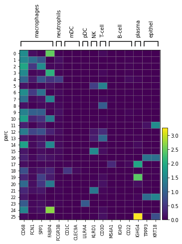
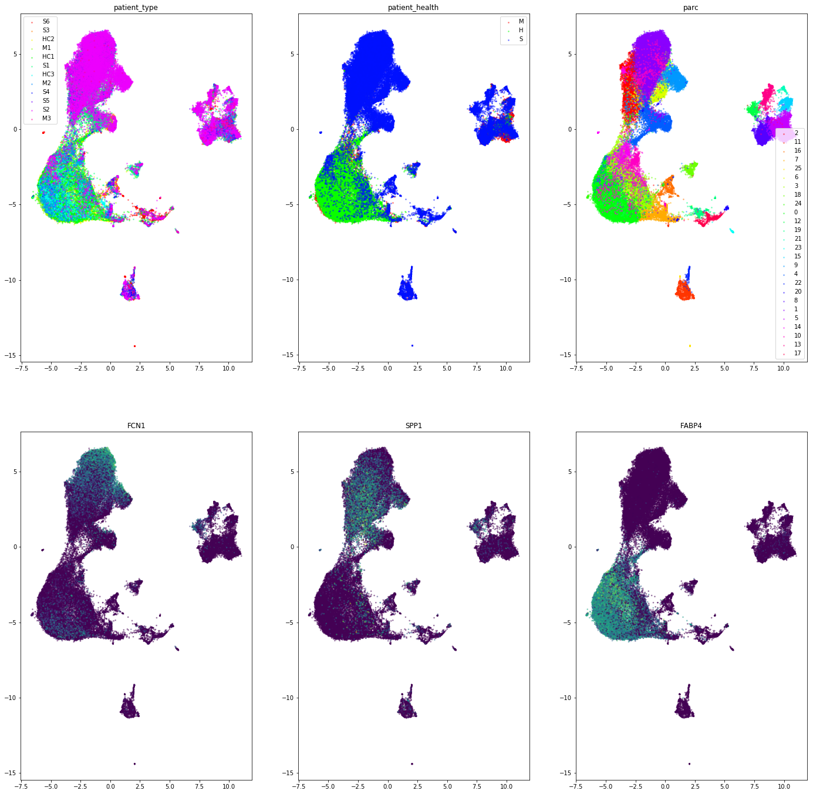
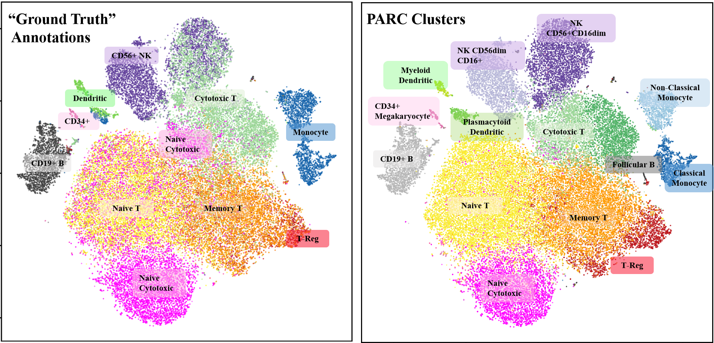
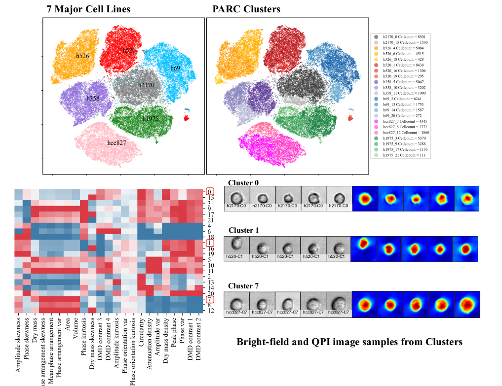

Examples
=========

Example 1: COVID-19 scRNA-seq Data
***********************************

Check out this `Jupyter Notebook <https://parc.readthedocs.io/en/latest/Notebook-covid19.html>`_
using the
`COVID-19 BALF Dataset (Liao et. al 2020) <https://www.nature.com/articles/s41591-020-0901-9>`_:

1. Pre-process the data.
2. Use ``PARC`` to cluster the data.
3. Integrate ``UMAP`` with ``HNSW`` such that the embedding in ``UMAP`` is constructed using the
   ``HNSW`` graph built in ``PARC``. This enables a very fast and memory-efficient visualization
   (particularly noticeable when ``n_samples > 1 000 000``).

Example 2: Iris Dataset from ``sklearn``
*****************************************

.. code-block:: python

	import parc
	import pandas as pd
	import matplotlib.pyplot as plt
	from sklearn import datasets

	# Load the Iris dataset
	iris = datasets.load_iris()
	x_data = pd.DataFrame(iris.data, columns=iris.feature_names)  # (n_samples x n_features = 150 x 4)
	y_data = iris.target

	# Plot the data (coloured by ground truth)
	column_a = iris.feature_names[0]
	column_b = iris.feature_names[1]
	plt.scatter(x_data[column_a], x_data[column_b], c=y_data)
	plt.title("Iris Dataset: Ground Truth")
	plt.xlabel(column_a)
	plt.ylabel(column_b)
	plt.show()

	# Instantiate the PARC model
	parc_model = parc.PARC(x_data=x_data, y_data_true=y_data)

	# Run the PARC clustering
	parc_model.run_parc()
	y_data_pred = parc_model.y_data_pred

	# View scatterplot colored by PARC labels
	plt.scatter(x_data[column_a], x_data[column_b], c=y_data_pred, cmap="rainbow")
	plt.title("Iris Dataset: PARC Predictions")
	plt.xlabel(column_a)
	plt.ylabel(column_b)
	plt.show()

	# Run UMAP on the HNSW knngraph already built in PARC
	# (more time and memory efficient for large datasets)
	csr_array = parc_model.create_knn_graph()
	x_umap = parc_model.run_umap_hnsw(x_data=x_data, graph=csr_array)

	# Visualize UMAP results
	plt.scatter(x_umap[:, 0], x_umap[:, 1], c=parc_model.y_data_pred)
	plt.title("Iris Dataset UMAP: PARC Predictions")
	plt.xlabel("umap_x")
	plt.ylabel("umap_y")
	plt.show()

Example 3: Digits Dataset from ``sklearn``
*******************************************

.. code-block:: python

	import parc
	import matplotlib.pyplot as plt
	from sklearn import datasets

	# Load the Digits dataset
	digits = datasets.load_digits()
	x_data = digits.data  # (n_samples x n_features = 1797 x 64)
	y_data = digits.target

	# Insantiate the PARC model
	parc_model = parc.PARC(
	    x_data=x_data,
	    y_data_true=y_data,
	    jac_threshold_type="median"  # "median" is default pruning level
	)

	# Run the PARC clustering
	parc_model.run_parc()
	y_data_pred = parc_model.y_data_pred

Example 4: (mid-scale scRNA-seq): 10X PBMC (Zheng et al., 2017)
*****************************************************************

1. Download the input data file and save it to the ``PARC/data/`` directory:
	 `pca50_pbmc68k.txt <https://drive.google.com/file/d/1H4gOZ09haP_VPCwsYxZt4vf3hJ1GZj3b/view?usp=sharing>`_.
2. You can view the target annotations here: `PARC/data/zheng17_annotations.txt <https:://github.com/ahill187/PARC/blob/main/data/zheng17_annotations.txt>`_.

.. code-block:: python

	import pathlib
	import parc
	import numpy as np
	import pandas as pd

	# Set the directory by replacing {PATH/TO/PARC}

	PARC_DIR = "{PATH/TO/PARC}/PARC/"
	x_data_path = pathlib.Path(PARC_DIR, "data/pca50_pbmc68k.txt")
	y_data_path = pathlib.Path(PARC_DIR, "data/zheng17_annotations.txt")

	# Load data
	# 50 PCs of filtered gene matrix pre-processed as per Zheng et al. 2017)
	# (n_samples x n_features) = (68579 x 50)
	x_data = pd.read_csv(x_data_path, header=None).values.astype("float")
	y_data = list(pd.read_csv(y_data_path, header=None)[0])

	# Instantiate the PARC model
	parc_model = parc.PARC(
			x_data=x_data,
			y_data_true=y_data,
			jac_std_factor=0.15,
			jac_threshold_type="mean",
			random_seed=1,
			small_community_size=50 # setting small_community_size = 50
			# cleans up some of the smaller clusters, but can also be left at the default 10
	)

	# Run the PARC clustering
	parc_model.run_parc()
	y_data_pred = parc_model.y_data_pred

	# View the model performance
	parc_model.stats_df

Example 5: 10X PBMC (Zheng et al., 2017) integrating ``scanpy`` pipeline
*************************************************************************

The description of the data for this is example can be found in the
`GitHub repository: single-cell-3prime-paper <https://github.com/10XGenomics/single-cell-3prime-paper/tree/master/pbmc68k_analysis>`_.

1. Download and unzip the `10X compressed folder "filtered genes" <http://cf.10xgenomics.com/samples/cell-exp/1.1.0/fresh_68k_pbmc_donor_a/fresh_68k_pbmc_donor_a_filtered_gene_bc_matrices.tar.gz>`_. Save it to ``PARC/data/``.
2. You can view the target annotations here:
	 `PARC/data/zheng17_annotations.txt <https://github.com/ahill187/PARC/blob/main/data/zheng17_annotations.txt>`_.
3. Install ``scanpy``:

.. code-block:: bash

	pip install scanpy

.. code-block:: python

	import scanpy as sc
	import pandas as pd
	import pathlib

	# Set the directory by replacing {PATH/TO/PARC}
	PARC_DIR = "{PATH/TO/PARC}/PARC/"
	x_data_path = pathlib.Path(PARC_DIR, "data/filtered_matrices_mex/hg19")
	y_data_path = pathlib.Path(PARC_DIR, "data/zheng17_annotations.txt")

	# Load data
	ann_data = sc.read(f"{x_data_path}/matrix.mtx", cache=True).T  # transpose the data
	ann_data.var_names = pd.read_csv(f"{x_data_path}/genes.tsv", header=None, sep='\t')[1]
	ann_data.obs_names = pd.read_csv(f"{x_data_path}/barcodes.tsv", header=None)[0]

	# Load the annotations as per correlation with pure samples
	y_data = list(pd.read_csv(y_data_path, header=None)[0])
	ann_data.obs["annotations"] = pd.Categorical(y_data)

	# Pre-process as per Zheng et al., and take first 50 PCs for analysis
	sc.pp.recipe_zheng17(ann_data)
	sc.tl.pca(ann_data, n_comps=50)

	# Instantiate the PARC model
	parc_model = parc.PARC(
		x_data=ann_data.obsm["X_pca"],
		y_data_true=y_data,
		jac_std_factor=0.15,
		jac_threshold_type="mean",
		random_seed=1,
		small_community_size=50 # setting small_community_size to 50 cleans up some of the
		# smaller clusters, but can also be left at the default 10
	)

	# Run the PARC clustering
	parc_model.run_parc()

	# Get the predicted cell types
	y_data_pred = parc_model.y_data_pred
	ann_data.obs["PARC"] = pd.Categorical(y_data_pred)

	# Visualize UMAP
	sc.settings.n_jobs=4
	sc.pp.neighbors(ann_data, n_neighbors=10, n_pcs=40)
	sc.tl.umap(ann_data)
	sc.pl.umap(ann_data, color="annotations")
	sc.pl.umap(ann_data, color="PARC")

Example 6: Large-scale (70K subset and 1.1M cells) Lung Cancer cells (multi-ATOM imaging cytometry based features)
*********************************************************************************************************************

Here we have a dataset containing single cell feature data for lung cancer cells.
The data was extracted from Bright Field and QPI images taken by Multi-ATOM imaging flow cytometry.
The data is a digital mix of 7 cell lines from 7 sets of pure samples.

The full dataset is 1.1M cells; however, depending on your computer's memory capacity,
you may want to run a smaller subset, so we have provided a subset of 70K cells as well.

To run the full dataset of 1.1M cells:

1. Download the `Lung Cancer 1.1M cell features and annotations from Elsevier <https://data.mendeley.com/datasets/nnbfwjvmvw/draft?a=dae895d4-25cd-4bdf-b3e4-57dd31c11e37>`_.
	 Save the files to:

	 ``PARC/data/datamatrix_LungCancer_multiATOM_N1113369.txt``
	 ``PARC/data/true_label_LungCancer_multiATOM_N1113369.txt``

2. Download the `H1975 digital spike test cluster data (n = 100) <https://drive.google.com/open?id=1kWtx3j1ixua4nQt1HFHlwzCHnOr7gvKm>`_.
	 Save it to ``PARC/data/datamatrix_RareH1975_LC_RS209_N281604Dim24.txt``.

3. You can view the H1975 annotations (which are all 0 since it's one cluster) under ``PARC/data/true_label_RareH1975_LC_PARC_RS209_N281604.txt``.

Otherwise, you can download the 70K subset:

1. Download the input data:
	`normalized image-based feature matrix 70K cells <https://drive.google.com/open?id=1LeFjxGlaoaZN9sh0nuuMFBK0bvxPiaUz>`_.
	 Save the file to ``PARC/data/datamatrix_LC_PARC__N70000.txt``

2. Download the target data (annotations):

	`Lung Cancer cells annotation 70K cells <https://drive.google.com/open?id=1iwXQkdwEwplhZ1v0jYWnu2CHziOt_D9C>`_.
	 Save the file to ``PARC/data/true_label_LC_PARC_N70000.txt``

3. Download the `H1975 digital spike test cluster data (n = 100) <https://drive.google.com/open?id=1kWtx3j1ixua4nQt1HFHlwzCHnOr7gvKm>`_.
	 Save it to ``PARC/data/datamatrix_RareH1975_LC_RS209_N281604Dim24.txt``.

4. You can view the H1975 annotations (which are all 0 since it's one cluster) under ``PARC/data/true_label_RareH1975_LC_PARC_RS209_N281604.txt``.

.. code-block:: python

	import parc
	import pandas as pd
	import pathlib

	# Set the directory by replacing {PATH/TO/PARC}
	PARC_DIR = "{PATH/TO/PARC}/PARC/"

	# Load the full dataset of 1.1M cells
	x_data_path = pathlib.Path(PARC_DIR, "data/datamatrix_LungCancer_multiATOM_N1113369.txt")
	y_data_path = pathlib.Path(PARC_DIR, "data/true_label_LungCancer_multiATOM_N1113369.txt")

	# # Alternatively, load the subset of 70K cells
	# x_data_path = pathlib.Path(PARC_DIR, "data/datamatrix_LC_PARC__N70000.txt")
	# y_data_path = pathlib.Path(PARC_DIR, "data/true_label_LC_PARC_N70000.txt")

	# Load data
	x_data = pd.read_csv(x_data_path, header=None).values.astype("float")
	y_data = list(pd.read_csv(y_data_path, header=None)[0])  # list of cell-type annotations

	# Instantiate PARC with the lung cancer data
	parc_model = parc.PARC(
		x_data=x_data,
		y_data_true=y_data,
		jac_weighted_edges=False  # provides unweighted graph to leidenalg (faster)
	)

	# Run the PARC clustering
	parc_model.run_parc()
	y_data_pred = parc_model.y_data_pred

	# Load the H1975 cell cluster (n = 100)
	x_data_path = pathlib.Path(PARC_DIR, "data/datamatrix_RareH1975_LC_RS209_N281604Dim24.txt")
	y_data_path = pathlib.Path(PARC_DIR, "data/true_label_RareH1975_LC_PARC_RS209_N281604.txt")
	x_data = pd.read_csv(x_data_path, header=None).values.astype("float")
	y_data = list(pd.read_csv(y_data_path, header=None)[0])

	# Instantiate PARC with the H1975 spiked cells
	parc_model = parc.PARC(
		x_data=x_data,
		y_data_true=y_data,
		jac_std_factor=0.15,  # 0.15 prunes ~60% edges and can be effective for rarer populations
		jac_threshold_type="mean",
		jac_weighted_edges=False
	)

	# Run the PARC clustering
	parc_model.run_parc()
	parc_labels_rare = parc_model.y_data_pred

