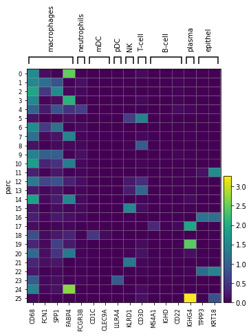

Example 1: COVID-19 scRNA-seq Data
***********************************

Check out this `Jupyter Notebook <https://parc.readthedocs.io/en/latest/Notebook-covid19.html>`_
using the
`COVID-19 BALF Dataset (Liao et. al 2020) <https://www.nature.com/articles/s41591-020-0901-9>`_:

1. Pre-process the data.
2. Use ``PARC`` to cluster the data.
3. Integrate ``UMAP`` with ``HNSW`` such that the embedding in ``UMAP`` is constructed using the
   ``HNSW`` graph built in ``PARC``. This enables a very fast and memory-efficient visualization
   (particularly noticeable when ``n_samples > 1 000 000``).

.. image:: ../_static/img/Covid_hnsw_umap.png
	:width: 600
	:alt: PARC visualizes cells by integrating UMAP embedding on the HNSW graph